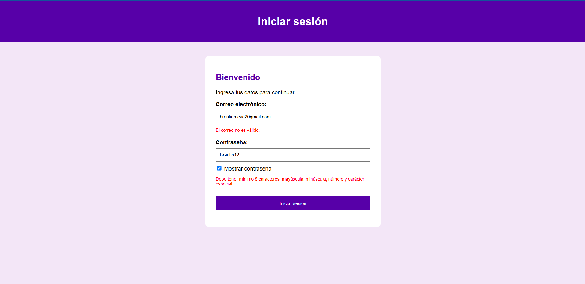
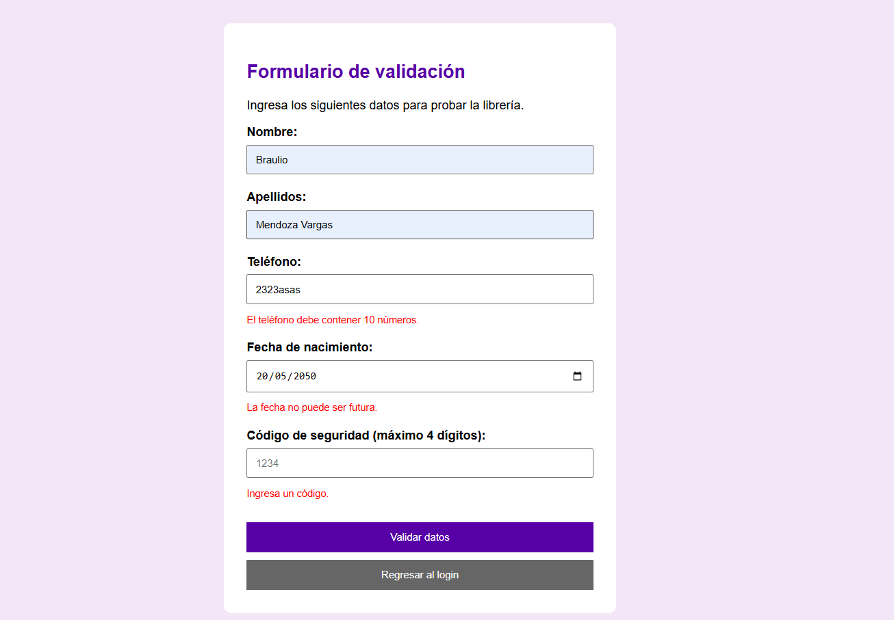
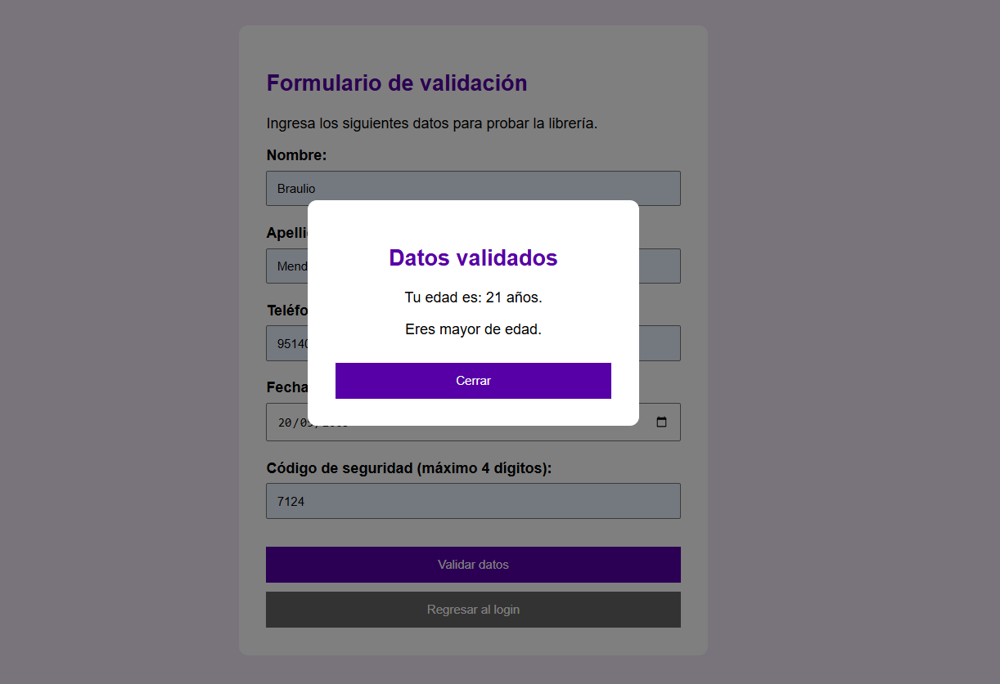

# Utilería JS

## Portada

**Nombre:** libreria de utilidades con validación de formularios con JavaScript

## ¿Qué problema resuelve?

Esta librería reúne funciones de JavaScript que pueden reutilizarse para validar datos dentro de formularios.

Permite verificar correos electrónicos, contraseñas, nombres, longitudes de números, teléfonos y fechas. También puede calcular la edad de una persona y comprobar si es mayor de edad.

La finalidad es evitar repetir el mismo código de validación en diferentes páginas.

El proyecto cuenta con dos páginas principales:

- `login.html`: utiliza las funciones para validar correo y contraseña.
- `index.html`: utiliza las demás funciones de la librería en un formulario y muestra la edad calculada mediante una ventana modal.

---

# Instalación

Para utilizar la librería dentro de un archivo HTML, primero incluye el archivo utileria.js en tu proyecto e impórtalo en tu documento HTM de esta forma:

```html
<script src="js/utileria.js"></script>
```

Después de cargar el archivo, las funciones pueden utilizarse directamente desde JavaScript.

---

# Ejemplos de uso

## validarCorreo()

Valida que un correo electrónico tenga un formato correcto.

```javascript
let resultado = validarCorreo("usuario@gmail.com");

console.log(resultado);
```

Resultado:

```text
true
```

---

## soloLetras()

Valida que un texto contenga solamente letras y espacios. También acepta letras con acentos y la letra ñ.

```javascript
let resultado = soloLetras("Braulio Mendoza Vargas");

console.log(resultado);
```

Resultado:

```text
true
```

---

## validarLongitud()

Comprueba que un número o texto no exceda una longitud máxima.

```javascript
let resultado = validarLongitud("1234", 4);

console.log(resultado);
```

Resultado:

```text
true
```

En el proyecto se utiliza para validar un código de máximo cuatro dígitos.

---

## calcularEdad()

Calcula la edad actual de una persona a partir de su fecha de nacimiento.

```javascript
let edad = calcularEdad("2000-11-20");

console.log(edad);
```

El resultado dependerá de la fecha actual.

---

## esMayorDeEdad()

Comprueba si una persona tiene 18 años o más.

```javascript
let resultado = esMayorDeEdad("2000-11-20");

console.log(resultado);
```

Resultado:

```text
true
```

---

## validarPassword()

Comprueba que una contraseña tenga:

- Mínimo 8 caracteres.
- Una letra mayúscula.
- Una letra minúscula.
- Un número.
- Un carácter especial.

```javascript
let resultado = validarPassword("Prueba123!");

console.log(resultado);
```

Resultado:

```text
true
```

---

# Funciones adicionales

Además de las seis funciones obligatorias se desarrollaron dos funciones adicionales.

## validarTelefono()

Comprueba que un número telefónico contenga exactamente 10 dígitos.

```javascript
let resultado = validarTelefono("9514010900");

console.log(resultado);
```

Resultado:

```text
true
```

Esta función utiliza una expresión regular para comprobar que únicamente existan números y que sean exactamente diez.

---

## validarFechaNoFutura()

Comprueba que una fecha ingresada no sea posterior a la fecha actual.

```javascript
let resultado = validarFechaNoFutura("2020-05-20");

console.log(resultado);
```

Resultado:

```text
true
```

Esta función convierte la fecha ingresada a un objeto `Date` y la compara con la fecha actual.

Puede utilizarse para validar fechas de nacimiento, registros o cualquier dato donde no tenga sentido utilizar una fecha futura.

---

# Integración de la librería

## Login

La página `login.html` utiliza:

```javascript
validarCorreo()
validarPassword()
```

Si alguno de los datos no cumple los requisitos, se muestra un mensaje de error.

Cuando ambos datos tienen un formato válido, se permite continuar hacia `index.html`.

No se realiza una autenticación real ni se utiliza una base de datos. El objetivo es demostrar el funcionamiento de las validaciones.

---

## Formulario de validación

La página `index.html` utiliza:

```javascript
soloLetras()
validarTelefono()
validarFechaNoFutura()
validarLongitud()
calcularEdad()
esMayorDeEdad()
```

El formulario solicita nombre, apellidos, teléfono, fecha de nacimiento y un código de verificación.

Si los datos son correctos se abre una ventana modal que muestra la edad calculada y si la persona es mayor o menor de edad.


---

# Capturas de pantalla

## Login



## Formulario



## Modal con edad calculada



---

# Video demostrativo

En el video se muestra el uso de la librería, las validaciones realizadas y el resultado dentro de las páginas.

**Video:** 
